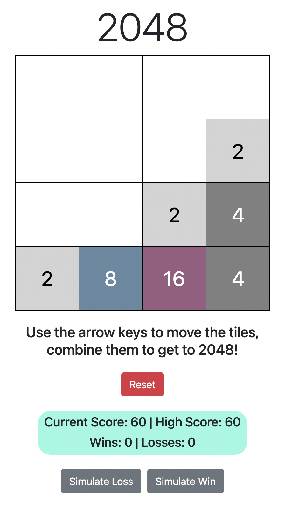

# 2048
2048 is a game developed by Gabriele Cirulli in 2014. The game begins with a 4x4 gameboard occupied by two tiles of value 2 or 4. The player must move all the current tiles left, right, up, or down. Tiles will slide as far as they can go on the gameboard before hitting another tile. If a tile hits another tile of the same value, however, they are combined into a tile of double their original value. The player wins when a "2048" tile is created.

# Screenshot

# Technologies used
JavaScript, HTML, CSS, jQuery, Bootstrap

# Getting started
[Click here to play!](./index.html)

# Next steps
Future improvements might include:
* Adding an animation when two tiles combine
* Adding a slight delay before a new tile becomes visible