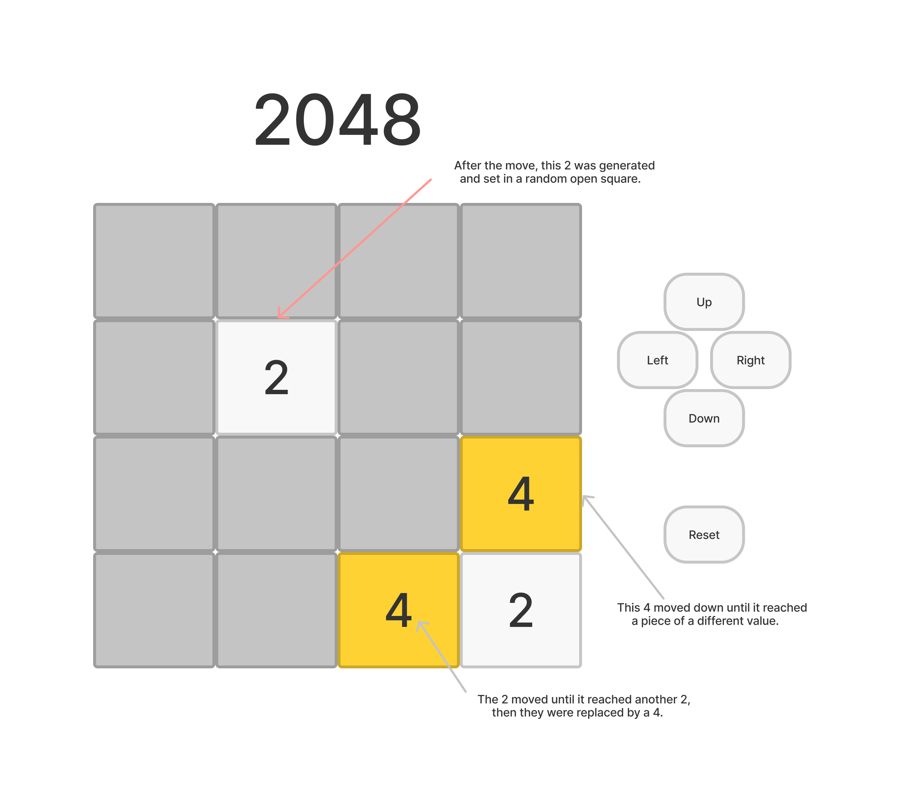

# 2048

## Wireframes

## User stories
1. As a user, I see the gameboard, which is a 4x4 grid of squares, has begun with two "2" pieces located at random squares.
2. I can click buttons to move the pieces left, right, up, or down.
3. When I move the pieces left (or right, up, or down), each piece moves left (or right, up, or down) until it reaches either (a) the end of the board, (b) the square before another piece of a different value, or (c) the square held by another piece of the same value (whichever comes first).
4. If a piece reaches the square held by another piece of the same value, they are both replaced by a piece with the sum of their values (e.g. two 2s are replaced by a 4, etc.).
5. In addition, after each move, a new piece is generated at a random open square.
6. The game ends in a win when a 2048 square is created, or in a loss if pieces can no longer be moved (because all squares are occupied, and no adjacent squares are occupied by pieces of the same value that can be combined).
7. I can click a reset button to reset the gameboard.
8. (Stretch) I can also use my arrow keys to move the pieces.
9. (Stretch) Whenever two pieces are "combined," this adds the value of the resulting piece to my score. I can see my current and high score, and a count of my wins/losses.

## Project plan

### Initializing the gameboard
1. In my HTML and CSS, I'll create divs for the gameboard itself and its sixteen squares and give them appropriate size/position/borders.
2. In my JavaScript, I'll create an array of four arrays (for each row) to represent the values of the pieces at each square on the gameboard. (So e.g. if there is one 2 at the end of the first row, the first sub-array should be set to [0,0,0,2].)
3. I'll create a function to randomly choose open squares for new pieces to be located, using the gameboard array.
4. I'll create a function to take an index on the gameboard array and give an element the appropriate location on the actual gameboard using CSS.
5. I'll create a function to generate new pieces using the functions in (3) and (4), and call it twice to generate the first two pieces.

### Moving pieces
1. I'll create a function to move pieces left. This will take the leftmost element in each row and start looking to its left until it finds (a) the end of the row, (b) an element of a different value, or (c) an element of the same value. It will give the index that the element should be "moved" to, and will call the function in (4) above using that index to move the actual piece, and will also update the gameboard array appropriately. The function will then do the same thing with the next-to-leftmost element in each row, and so on. Finally, it will call the functions to randomly generate a new piece.
2. In my HTML and CSS, I'll create a button to move pieces left. In my JavaScript, I'll grab it and give it an event listener so that clicking it will call the "move left" function.
3. For the case where a piece moves to the square held by a piece of the same value, I'll create a function to remove both pieces and replace them with a piece of the appropriate value.
4. I'll create similar functions and buttons for moving right, up, or down.
5. (Stretch) I may try writing event listeners to allow the user to move the pieces by using their arrow keys.
6. (Stretch) I may write code to keep track of the current score, high score, and win/loss count.

### Endgame
1. I'll create functions to check the gameboard array after each move for a win or loss. If it finds one, it will end the game and display an appropriate message.
2. I'll create a reset button to reset the gameboard.